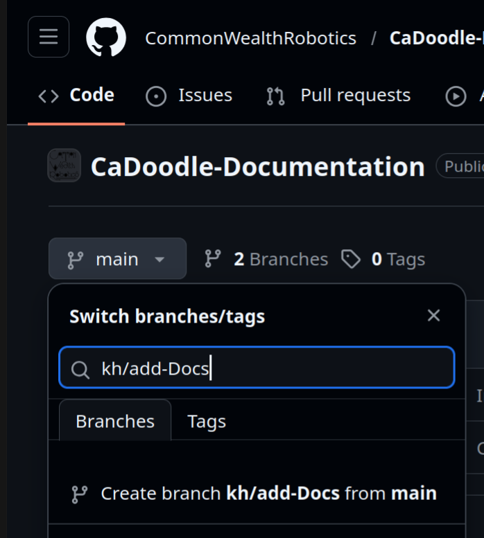
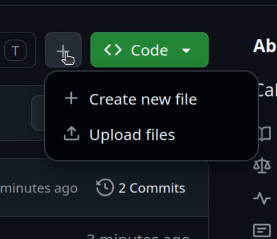
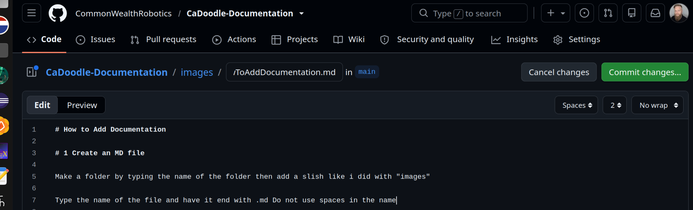
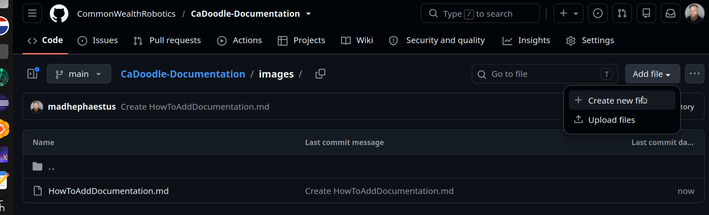
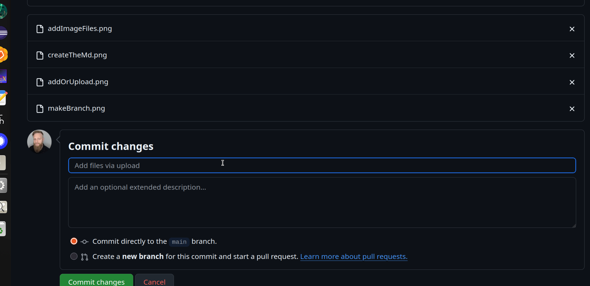

# How to Add Documentation

First you will need to create a GitHub account. 

Next you will need to login to the CaDoodle Discord server https://discord.gg/fuJc3cbB7w

DM your github name to @Kevin Harrington to be added to this project. 

# 1 make a branch in the repository

# 1 Create an MD file

Cread your file 

Make a folder by typing the name of the folder then add a slish like I did with "images"

Type the name of the file and have it end with .md Do not use spaces in the name

# 2 Add Images to the repository

Start by clicking on the add files button:

Then drag in the image files

